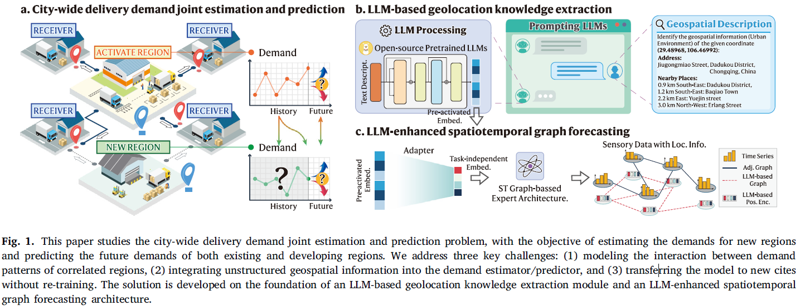
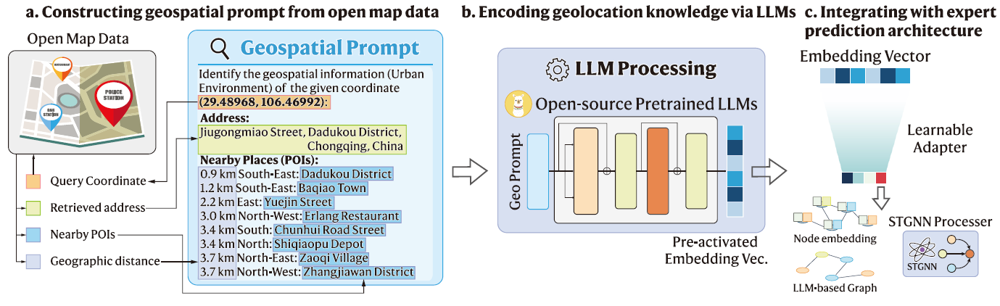

# TRE'25: IMPEL: A Large Language Model Empowered Graph-based Learning Approach for City-wide Delivery Demand

[](https://doi.org/10.1016/j.tre.2025.104075)
[](https://opensource.org/licenses/MIT)

This repository contains the official PyTorch implementation for the paper:

> **Joint estimation and prediction of city-wide delivery demand: A large language model empowered graph-based learning approach**<br>
> Tong Nie, Junlin He, Yuewen Mei, Guoyang Qin, Guilong Li, Jian Sun, Wei Ma<br>
> *Transportation Research Part E: Logistics and Transportation Review, 2025.*

Our model, **IMPEL** (Inductive Message-Passing Neural Network with Encoding from LLMs), addresses the challenging problem of jointly estimating delivery demand for new urban regions and predicting future demand for all regions.

## Overview

The proliferation of e-commerce has intensified the complexity of urban delivery demand. A key challenge is the "cold-start" problem: how to estimate demand for newly developed service regions and transfer a predictive model to entirely new cities without sufficient historical data.

IMPEL tackles this by leveraging the powerful reasoning capabilities of Large Language Models (LLMs) to extract rich, transferable geospatial knowledge. This knowledge is then integrated into a specialized graph neural network architecture designed for spatiotemporal forecasting.

The core problem and our proposed solution are illustrated below (Figures 1,2 from the paper):

<table align="center">
<tr>
<td align="center"><b>Figure 1: The Problem - Joint Estimation & Prediction</b></td>
<td align="center"><b>Figure 2: The Solution - The IMPEL Framework</b></td>
</tr>
<tr>
<td></td>
<td></td>
</tr>
</table>


The core pipeline of our approach involves these key steps:

1.  **Geospatial Prompting:** We query a public map service (like OpenStreetMap) for location information (address, nearby POIs) for each region of interest (ROI).
2.  **LLM-based Encoding:** We feed this information as a text prompt to a pre-trained LLM (e.g., Llama) to generate a dense, high-dimensional embedding that captures the region's functional and geographical context.
3.  **Graph-based Learning:** This LLM-generated embedding is used in two ways within our GNN predictor:
    *   As a transferable **node-specific feature** to characterize individual region patterns.
    *   To construct a **functional graph** based on the similarity between embeddings, capturing latent relationships between regions that go beyond simple physical proximity.
4.  **Inductive Training:** The model is trained end-to-end with a joint reconstruction and forecasting objective on randomly masked subgraphs, enabling it to generalize to new, unseen regions and cities (zero-shot transfer).

## Key Features

-   **LLM-Powered Geospatial Encoding:** Extracts rich, generalizable location features from unstructured text, eliminating the need for laborious, city-specific feature engineering.
-   **High Transferability:** Demonstrates strong zero-shot performance when transferring a model trained on one city to another, even when the target city has newly developed regions with no historical data.
-   **State-of-the-Art Performance:** Significantly outperforms existing baselines in accuracy, efficiency, and transferability across two real-world datasets (package and food delivery) from 8 different cities.
-   **Inductive by Design:** Can handle dynamic graphs where new nodes (regions) are introduced during inference without requiring model retraining.

## Installation

1.  Clone the repository:
    ```bash
    git clone https://github.com/tongnie/IMPEL.git
    cd IMPEL
    ```

2.  Create a conda environment and install dependencies. We recommend using Python 3.9+.
    ```bash
    conda create -n impel python=3.9
    conda activate impel
    pip install -r requirements.txt
    ```
    `requirements.txt` includes:
    ```
    einops==0.8.1
    geopy==2.4.1
    joblib==1.2.0
    numpy==1.24.2
    pandas==1.3.5
    PyYAML==6.0
    PyYAML==6.0.2
    scipy==1.16.0
    torch==2.0.0
    torch_geometric==2.3.0
    torch_scatter==2.1.1+pt20cu118
    ```

## Dataset Preparation

We use two real-world datasets in our paper:
1.  **Package Delivery:** A public dataset from Cainiao Network covering 5 cities in China. (Wu et al., 2023)
2.  **Food Delivery:** A proprietary dataset covering 3 cities in the US.


The Package Delivery dataset is adopted and processed from [LaDE](https://github.com/wenhaomin/LaDe/tree/master). 
You can follow the instructions in that repository to download the raw data and process them using:

```bash
    python gen_dataset.py
    python gen_adj.py
```

We provide the processed datasets in `/data`.
We also provide the pre-generated LLM-based embeddings for these datasets in `/data`.


## Running Experiments

All experiments can be run via the scripts under the directory `/experiments`. 
The configurations for models and experiments are located in each folder, e.g., `./dcrnn/main.py`.

### Task 1: Joint Estimation and Prediction in a Single City

This task trains and tests the model on a single city, where a random subset of regions is held out during testing to simulate newly developed areas.

```bash
# Example for Shanghai
python experiments/impel/main.py --dataset Delivery_SH --model_name impel --num_unknown_nodes 10 --num_masked_nodes 6 
```

run baselines, e.g.,
```bash
# STGCN
python experiments/stgcn/main.py --dataset Delivery_SH --model_name stgcn --num_unknown_nodes 10 --num_masked_nodes 6 
````


### Task 2: Zero-Shot Transfer to a New City (with New Regions)

The most challenging scenario. Train on a source city with missing regions and test on a target city that also has new, unobserved regions.

You need to pretrain the model following the same training step as in Task 1. 

```bash
# Example: Train on Shanghai, test on Hangzhou with 10 new regions
# 1. Train on Shanghai with masked regions (as in Task 1)
python experiments/impel/main.py --dataset Delivery_SH --model_name impel --num_unknown_nodes 10 --num_masked_nodes 6 

# 2. Test on Chongqing with 10 new regions
python experiments/impel/transfer_partial.py --source_data Delivery_SH --target_data Delivery_HZ --num_unknown_nodes 10
```

## Citation

If you find this work useful for your research, please cite our paper:

```bibtex
@article{nie2025joint,
  title={Joint estimation and prediction of city-wide delivery demand: A large language model empowered graph-based learning approach},
  author={Nie, Tong and He, Junlin and Mei, Yuewen and Qin, Guoyang and Li, Guilong and Sun, Jian and Ma, Wei},
  journal={Transportation Research Part E: Logistics and Transportation Review},
  volume={197},
  pages={104075},
  year={2025},
  publisher={Elsevier},
  doi={10.1016/j.tre.2025.104075}
}
```

## Acknowledgements

This repository is built upon [LaDE dataset](https://github.com/wenhaomin/LaDe/tree/master) and their code for experiment. 
We appreciate their efforts to share this dataset and code.

## License

This project is licensed under the MIT License - see the [LICENSE](LICENSE) file for details.